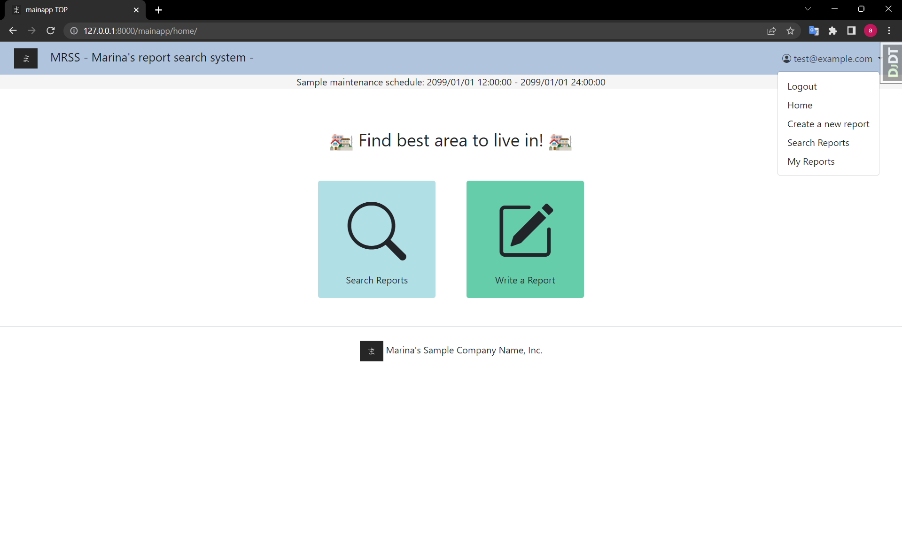

# Marina's Report Search System (myprj0623)

One can create and search problem reports of a local area in the UK.<br>

## License

This work (project name: myprj0623) is a portfolio temporarily published for my personal job search. <br>
Only recruiters can use this work to check my codes. <br>
NO ONE ELSE HAS THE PERMISSION TO MODIFY AND DISTRIBUTE. <br>
THIS IS NOT AN OPEN SOURCE SOFTWARE.<br>

## Features

This system provides unique information to people who are moving or trying to buy properties.<br>
You can use:

* Create, Read & List (Filter), Update, Delete Function with Responsive Design
* Authentication Function (Customized AllAuth)
* Admin Function (Customized DjangoAdmin)
* Importing / Exporting constants from / to DB Function (Custom Command)

## Visuals and Usage

* <b>Welcome Page (Landing Page): </b><br>
  Go to sign up / sign in page from this landing page.

  http://127.0.0.1:8000/mainapp/welcome/
  <br>

  Manage account on the redirected page (allauth function):

  http://127.0.0.1:8000/accounts / {page name}
    * Sign in <br>
      
      <br>
      
      <br>
    * Sign up <br>
      
      <br>
      
      <br>
      
      <br>
      
      <br>
      
      <br>

* <b>Home Page: </b><br>
  Access to all functions.

  http://127.0.0.1:8000/mainapp/home/
    * Basic User <br>
      
      <br>
    * Admin User <br>
      
      <br>

* <b>Create a New Report Page: </b><br>
  Create a new report.

  http://127.0.0.1:8000/mainapp/report/create/
  <br>
  
  <br>

* <b>Report Detail Page: </b><br>
  The details of the report are available here.
  The report can be amended or deleted by admin users and / or the user who created it (Created User).

  http://127.0.0.1:8000/mainapp/report/detail/ {report id} /
    * Admin or Created User <br>
      
      <br>
    * Others <br>
      
      <br>

* <b>Report Search Page: </b><br>
  Search all reports submitted by users.
  An admin is also able to delete / go to DjangoAdmin update page of the report.

  http://127.0.0.1:8000/mainapp/report/search/
    * Basic User <br>
      
      <br>
    * Admin User <br>
      
      <br>

* <b>My Reports Page: </b><br>
  The list of your reports is available here.

  http://127.0.0.1:8000/mainapp/report/my_reports/
  <br>
    * Basic User <br>
      
      <br>
    * Admin User <br>
      
      <br>

* <b>DjangoAdmin Page: </b><br>
  Project is managed from this page.

  http://127.0.0.1:8000/admin/
  <br>
    * DjangoAdmin Home <br>
      
      <br>
    * DjangoAdmin Report Home (List) <br>
      
      <br>
    * DjangoAdmin Report Detail <br>
      
      <br>

## Requirement

See "myprj0623 > requirements.txt"

# Installation

1. Get Python3 and PyCharm<br>
   (For your information: https://www.guru99.com/how-to-install-python.html)
2. Open PyCharm and go to "VCS > Get From Version Control"<br>
   (If you already have your own project in PyCharm, go to "Git > Clone")
3. Get clone URL, enter the URL into PyCharm's modal, also select your local directory, and "Apply."
4. Copy "src/myprj0623/.env_local" and create ".env" to the same directory.
5. Open terminal in your PyCharm.
6. Install Django and all libraries in [Requirement](#Requirement) with the following commands:

```bash
pip install Django==4.1.3
pip install django-bootstrap-v5==1.0.11
pip install django-bootstrap-datepicker-plus==5.0.3
pip install django-crispy-forms==2.0
pip install crispy-bootstrap5==0.7
pip install django-environ==0.10.0
pip install django-allauth==0.54.0
```

7. Go to "File > Settings > Project: {your directory name} > Python Interpreter" and make sure that you see <br>
   everything you installed.
8. Run the following command:

```bash
cd ./src/myprj0623
python manage.py makemigrations
python manage.py migrate
```

9 Create an admin user with the following command:

```bash
 python manage.py createsuperuser
```

10. Open base.py ("src > myprj0623 > core > settings > base.py") and change IS_FIXTURE flg to True.
11. Run the following command and copy fixture file path from the log in your terminal:

```bash
python manage.py create_fixture_file_from_current_db_const
```

12. Run the following command:

```bash
python manage.py loaddata {fixture file path}
```

13. Open Commit window in PyCharm and rollback "base.py," or open "base.py" and change IF_FIXTURE flg to False.

14. Run manage.py ("src > myprj0623 > manage.py").<br>
    (Move mouse cursor to manage.py in PyCharm and right click, then you'll see the "Run" button. <br>
    After you run it once, open Run Configurations window in PyCharm, add parameter "runserver 127.0.0.1:8000" <br>
    and run again.)<br>
15. Access Email Addresses Home in DjangoAdmin (http://127.0.0.1:8000/admin/account/emailaddress/) and create a new <br>
    record for admin email address (tick both verify and primary flags). <br>
    Now you have an admin account for this project.
16. Go to any page of the mainapp (http://127.0.0.1:8000/mainapp/{any page}/) and Sign out.
17. From the redirected welcome page, click "Sign up" and enter email and password to create your standard user <br>
    (basic permissions).
18. After clicking "Sign Up", see console in your PyCharm. You will see confirmation email there.
19. Click confirmation URL and confirm your email. Now you have both an admin account and standard (basic) account <br>
    for this project. This section is now complete.

## Note

This portfolio demonstrates my ability to create a sample WEB application from scratch and shows that I have <br>
sufficient coding experience.<br>
There are no documents in this project which are usually required in system development method (documents of <br>
function design, unit test, coding rules, etc.) as the format and quidelines differ, depending on teams.<br>

## Author

* Marina Miyake
* marinamiyake@outlook.com
